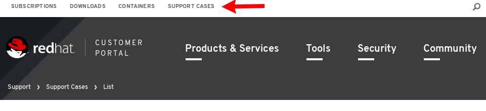
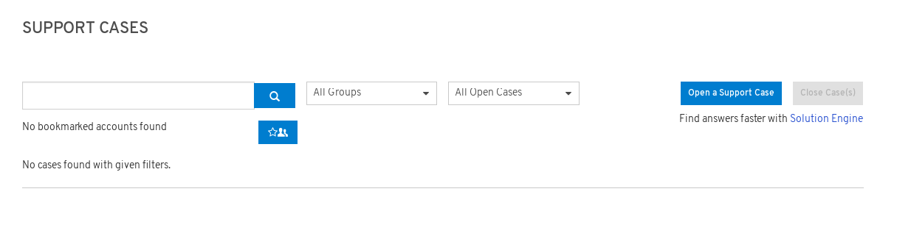

# Documentation

Here you will find instructions on how to register for the Red Hat Connect for Technology Partner program. Click on the Zone you want to register for and you will find further detailed information.

# Getting Help

For general questions regarding Red Hat Connect partner program, registering with the partner portal or certifying your application contact:

connect@redhat.com

For any web portal issues or help with your certified image, please open a support case on the Red Hat Customer Portal and follow the steps below.

To open a support case:

Login to: [Red Hat Customer Portal](https://access.redhat.com/)

Click on _Support Cases_ located on white bar located at the top of the page

Then click _Open a New Support Case_

Complete the Support Case Form with special attention to the following fields:

From the **Product** field, select _OpenShift Container Platform_.

From the **Product Version** field, select the version of the Red Hat product.

In the **Case Type** field, select _Certification_.

In the **Problem Statement** field, add a brief description of the issue.

In the **Case Description** field, add specific details of the encountered issue. If you have a screen shot of the error, please include it in your ticket.
