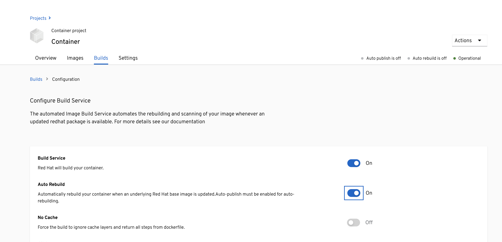

# Maintaining image grades

As software package vulnerabilities are discovered it is important to rebuild container images to keep them up-to-date. Without automation this process quickly becomes onerous and reflects poorly on the catalog listing. Organizations frequently run vulnerable software but few want to download vulnerable software. It is a requirement of Red Hat Connect Partner Program that the partner maintain the image certification. Red Hat publishes a [Container Health Index](https://access.redhat.com/articles/2803031) as described below to inform users about those situations where an image might need to be updated.

If a container image falls below an "A" grade, a periodic email from connect@redhat.com will be sent out to the partner contact list.

In order to keep the image up to date, it is recommended that the partner use the Red Hat Connect Build Service located in the Project section of Red Hat Connect. The option Auto-Rebuild will automatically rebuild your container and automatically publish it.

The only requirement to use this service is that the image bits be accessible via github/gitlab. If the github is internal, ssh access to the bits is required. This service automates the rebuilding of the image whenever an updated Red Hat package is available.

