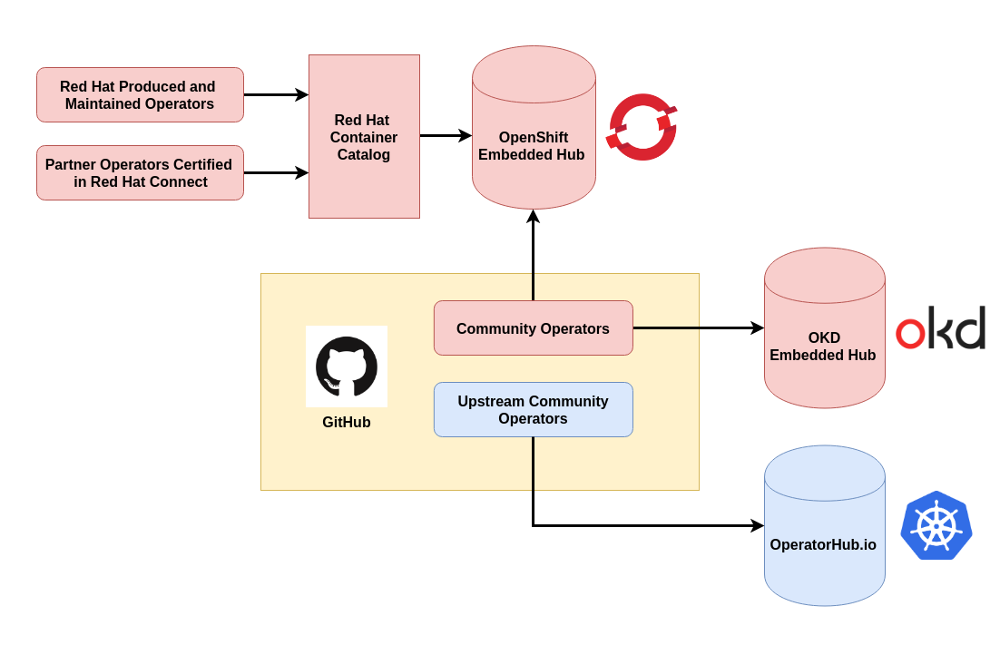

# Introduction to Operators

An Operator is a method of packaging, deploying and managing a Kubernetes application. A Kubernetes application is an application that is both deployed on Kubernetes and managed using the Kubernetes APIs and kubectl/oc tooling. You can think of Operators as the runtime that manages this type of application on Kubernetes.

## Distributing Operators

As a partner, there are three places where you can contribute an operator, each with a different publishing endpoint:

* **Certified Operators** - submitted through Red Hat Connect - listed in OpenShift OperatorHub
* **Community Operators** - submitted through GitHub - listed in both OpenShift _and_ OKD OperatorHub
* **Upstream Community Operators** - also submitted through GitHub -  listed in the [OperatorHub.io](https://operatorhub.io)  community website

### Operator Technical Track

The [Operator technical track](https://redhat-connect.gitbook.io/red-hat-technical-tracks/operators) is a set of curated resources to guide you through learning what Operators are, how to develop an Operator, and how to certify and upgrade your Operators.&#x20;
