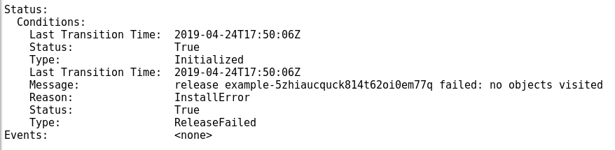

# Validate Your Operator

## Operator Courier  

To validate your Metadata Files \(CRD, Package Manifest and CSV\) for completeness and syntax please run the [Operator Courier](https://github.com/operator-framework/operator-courier)  

Once Operator Courier is installed you can run the following commands and review the output. If no output is shown then your operator passes linting process. In this example the Metadata Files are located in the bundle/ directory 

```text
operator-courier verify bundle/
operator-courier verify --ui_validate_io bundle/
```

## Preview your CSV

To preview and check for syntax of your CSV upload your file to [Operator Preview](https://operatorhub.io/preview) to see how it renders. 

## PackageName-Uniqueness

 When creating your package the name must be unique or it will cause issues with the OperatorHub catalog. For example if you have already published a community operator with the same package name as the one you are attempting to certify it will cause issues. Since the names must be unique we suggest adding the **-certified** suffix to the packageName for all certified operators, as a preventative measure.


If you look at the mariadb example located here: [https://github.com/RHC4TP/operators/blob/master/examples/operator\_sdk/helm/mariadb-operator/bundle/mariadb.package.yaml\#L1](https://github.com/RHC4TP/operators/blob/master/examples/operator_sdk/helm/mariadb-operator/bundle/mariadb.package.yaml#L1)   
You will notice that the packageName only states mariadb. If you were certifying this operator you would want to include the -certified suffix to that packageName.


## Adding Security Context Constraints

Any Security Context Constraints \(or SCCs\) that are required should be listed under the \`resourceNames:\` field as it's own array item. Whether it is just one or combination of: privileged, anyuid, hostaccess, hostnetwork, hostmount-anyuid, etc.

These SCCs are placed under a \`clusterPermissions:\` block, which would be directly inline with the \`permissions:\` field. The order of fields at a specific indentation level doesn't matter as YAML items are unordered data.This can be placed anywhere in the CSV file, as long as it is at the proper indentation level.  


Take into consideration the service account you're granting these permissions to. For applications requiring special privileges, such as root or a predetermined UID, you grant those extra privileges separately from the operator's own service account.

This requires an extra service account to be created for the operator to deploy the resources \(handled automatically when it's put into the CSV\), but you have to make certain that your Deployment/Daemonset/Pods run with that service account.


A good example of this can be referenced here:

[https://github.com/RHC4TP/operators/blob/master/examples/operator\_sdk/helm/mariadb-operator/bundle/mariadb.v0.0.4.clusterserviceversion.yaml\#L269-\#L280](https://github.com/RHC4TP/operators/blob/master/examples/operator_sdk/helm/mariadb-operator/bundle/mariadb.v0.0.4.clusterserviceversion.yaml#L269-#L280)


## Custom Resource Status Field Requirement 

In order to pass certification, your operator must provide some sort of Status update to the Status: field in the deployed Custom Resource. This check is performed by the operator-sdk scorecard. An example schema of the Status field \(excerpt from a helm operator built using the SDK\) is: 



If you're building either a Helm or Ansible operator using the SDK, then you're covered in this regard, as these operators automatically provide a CR Status for you, and there is nothing extra that you would have to do. However, if you're building an operator in Go \(using the SDK\) or some other framework, you'll need to make certain that you're updating the Status field of the CR with relevant info regarding the running state of the Custom Resource.


This is done automatically for Helm or Ansible operators using later versions of the SDK



