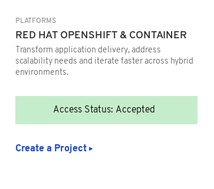
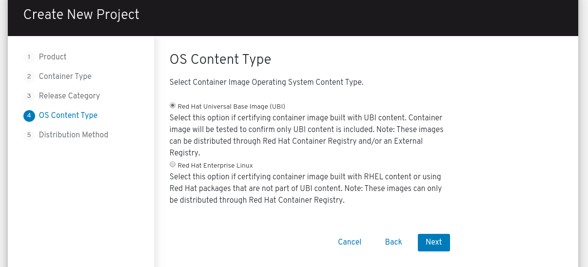
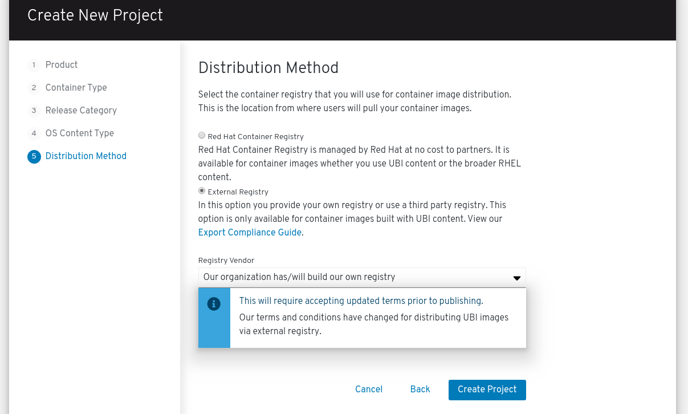

# Creating a Container Application Project


Certified container images are delivered to customers through the Red Hat Connect Image Registry to run on a supported Red Hat container platform. Your product and images will be listed in the Red Hat Container Catalog using the listing information you provide. To begin the process to Certify your Application you must first Create a Container Project.‌


From the [Red Hat Partner Connect web portal](https://connect.redhat.com/), select **ZONES** at the top of the page.‌

Scroll down to the RED HAT OPENSHIFT & CONTAINER zone and click **CREATE A PROJECT**.‌

Complete the Create New Project Wizard.

## 1. Product

## 2. Container Type

Select **Container Application**

## 3. Release Category

## 4. OS Content Type


This information cannot be changed after project is created


## 5. Distribution Method


This information cannot be changed after project is created


Once you have finalized all your selection click on **Create Project.**

