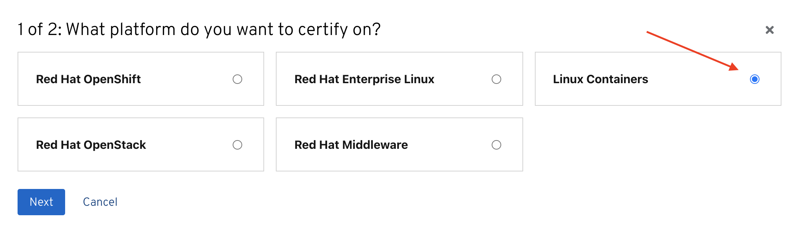
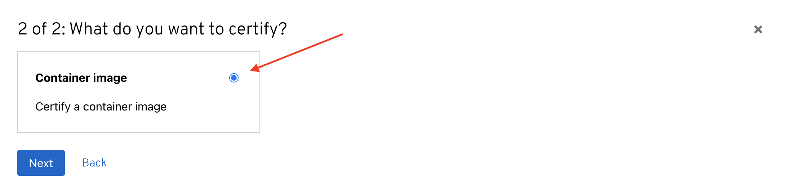

# Creating a container application project


Certified container images are delivered to customers through the Red Hat Connect Image Registry to run on a supported Red Hat container platform. Your product and images will be listed in the Red Hat Container Catalog using the listing information you provide. To begin the process to Certify your Application you must first Create a Container Project.‌


Click **PRODUCT CERTIFICATION** at the top of the page and click** Manage projects**

Click _**Create Project**_&#x20;

Select _Linux Containers_ in the modal then click **NEXT**.

Select _Container image_ in the modal then click** NEXT.**‌

Provide the required information to create your project.

## 1. Project Name

## 2. OS Content Type


This information cannot be changed after project is created


## 3. Distribution Method


This information cannot be changed after project is created.&#x20;

_If this is for the Red Hat Marketplace, you **cannot **choose Non-Red Hat Container Registry. You have the other 2 options to chose from and must complete _[_Export Compliance_](https://redhat-connect.gitbook.io/red-hat-partner-connect-general-guide/initial-onboarding/export-compliance)_. _


Once you have finalized all your selection click on **Create project.**

****
