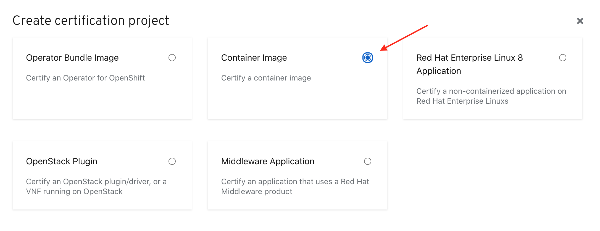
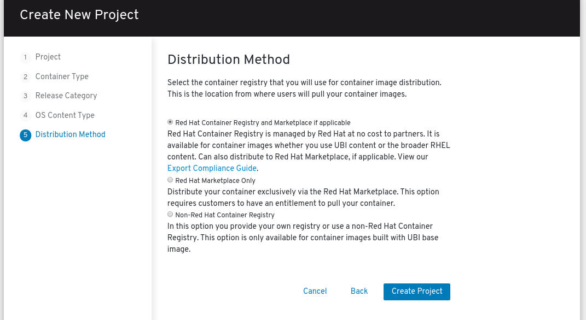
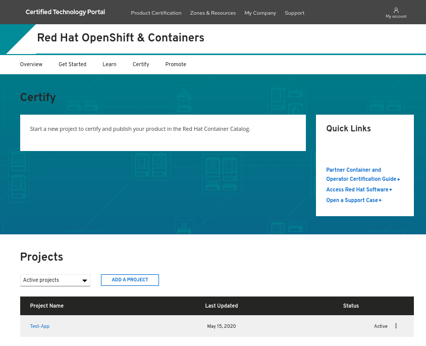

# Creating a container application project


Certified container images are delivered to customers through the Red Hat Connect Image Registry to run on a supported Red Hat container platform. Your product and images will be listed in the Red Hat Container Catalog using the listing information you provide. To begin the process to Certify your Application you must first Create a Container Project.‌


Click **PRODUCT CERTIFICATION** at the top of the page and click **Manage projects**

Click _**Create Project**_ 

Select _Container image_ in the modal then click **NEXT.**‌

Complete the Create New Project Wizard.

## 1. Project

## 2. Container Type

Select **Container Application**

## 3. Release Category

## 4. OS Content Type


This information cannot be changed after project is created


## 5. Distribution Method


This information cannot be changed after project is created. 

_If this is for the Red Hat Marketplace, you **cannot** choose Non-Red Hat Container Registry. You have the other 2 options to chose from and must complete_ [_Export Compliance_](https://redhat-connect.gitbook.io/red-hat-partner-connect-general-guide/initial-onboarding/export-compliance)_._ 


Once you have finalized all your selection click on **Create Project.**


Different ways to access your project:   
➡ Click on the Zones Section in Header &gt; Red Hat Openshift & Container &gt; Certify Page.   
➡ You can also access your projects by going to Product Certification&gt; Manage projects 


