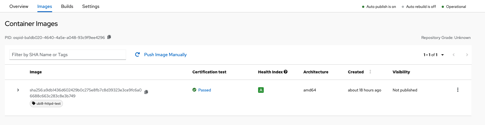

# Image Scanning & Verification

## Image Scan

After the image has completed being uploaded, the image will display _Scan In-Progress_ in the **Status** column:


It may be necessary to refresh the browser page to see the current status.


Once the image has completed the scan in Red Hat Connect repository, the image will show the results of the scan. Scans normally take about 10-15 minutes to complete.

Clicking on the certification results \(Passed/Failed\) will expand on the scan details. If the project has met all prerequisites specified in the certification checklist, you will now be able to publish/unpublish the image to the Red Hat Container Catalog. The three dots on the far right will expand a menu with options for tag changes and to delete the image. 

## Image Verification


If the image returns a Passed scan status but the Publish button is still blocked, verify that you have completed the Certification Checklist.


If the image returns a **Failed** scan status, the results will automatically be displayed. Click on the name of the failed item \(in this example, _has\_licenses_\) for reference to the policy guide.


If you receive an **Access Denied** response when accessing the Policy Guide, please open a Support Ticket. Instructions on how to open a Support Ticket can be found in the [Getting Help](https://redhat-connect.gitbook.io/red-hat-partner-connect-general-guide/managing-your-account/getting-help/support-ticket) Section.


