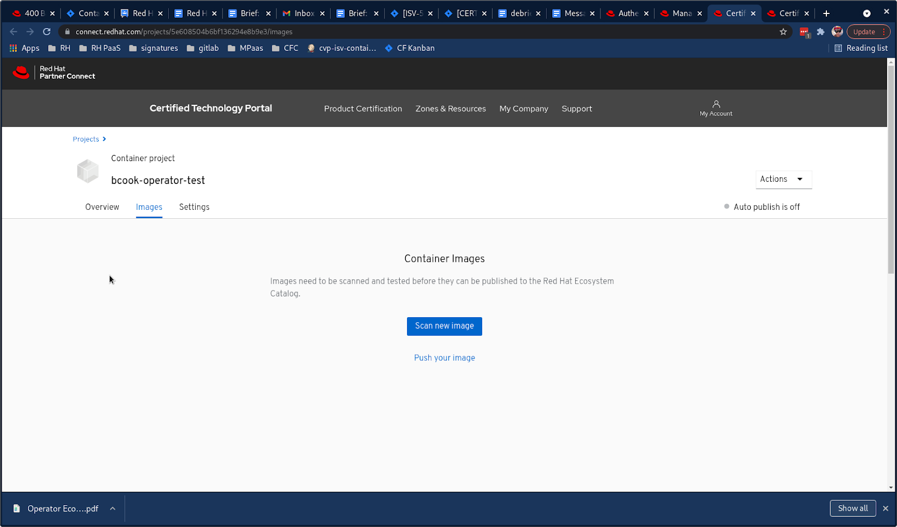
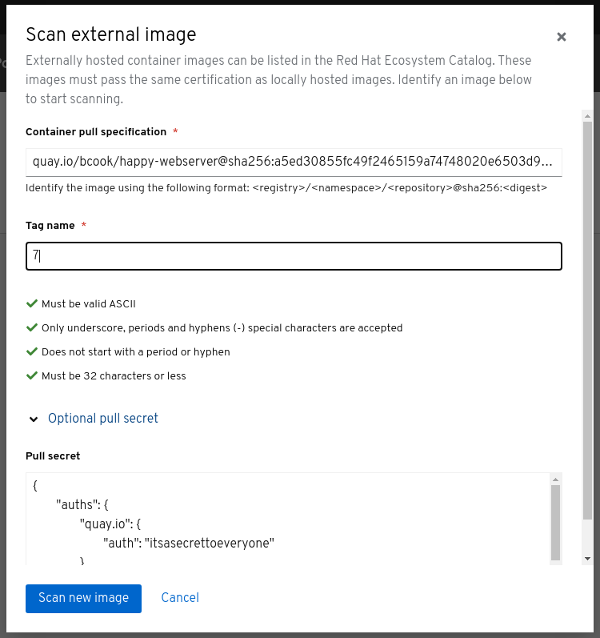

# Scanning Images to be published in Third Party Registries

Images published in third party registries such as quay.io or DockerHub are scanned from their remote location instead of pushing the image to scan.connect.redhat.com.

_Caution_: The image can be scanned from any location the system has access to, but will be published to the catalog with the location specified in the project's settings. _It is the user's responsibility to ensure the image is in the correct location when published._

| **Important Note if using DockerHub as a Scanning Source**                                                                                                                                                                                                                                                                                                                                                      |
| --------------------------------------------------------------------------------------------------------------------------------------------------------------------------------------------------------------------------------------------------------------------------------------------------------------------------------------------------------------------------------------------------------------- |
| Docker imposes strict rate limits on unauthenticated pull requests, as well as pull requests using Free accounts. Unauthenticated/Free account pull requests originating from Red Hat IP addresses are automatically blocked, which will causes scanning failures. Therefore, you **must** supply authentication for a Pro or higher level DockerHub account to prevent scanning failures due to rate-limiting. |
| _This is required even if the the DockerHub repository is open for unauthenticated access._                                                                                                                                                                                                                                                                                                                     |
| Red Hat is not responsible for scanning errors caused by rate-limiting due to using unauthenticated access or the use of an authenticated account that has hit its daily pull limit.                                                                                                                                                                                                                            |

## **Initiating an image certification scan**

**If the remote location requires authentication:**

1. Generate config.json formatted registry secret

`podman login --username [USERNAME] --password [PASSWORD] --authfile ./temp-authfile.json [REGISTRY]`

1. saving credentials to the Red Hat Connect project via API or web user interface

_via api:_

Save the following as a script e.g. patch-secret.sh. Set the script as executable.

`#!/bin/bash  `\
`auths=$(cat ./temp-authfile.json)  `\
`escaped_auths="$(echo $auths | jq -R)"  `\
`payload="{\"container\": {\"kube_objects\": $escaped_auths}}"  `\
`curl --location -g --request PATCH "https://catalog.redhat.com/api/containers/v1/projects/certification/id/$1" \  `\
`--header 'Content-Type: application/json' --header "X-API-KEY: $2" --data-raw "$payload"`

Run the script passing in the project ID and API key as CLI parameters:

`./patch-secret.sh [project id] [api key]`

_via UI:_

Add the contents of temp-authfile.json to the 'Pull Secret' field as shown in the next section.

**Initiating a scan via the API:**

Using the API requires having a Red Hat Connect API key.

`curl --location -g --request POST 'https://catalog.redhat.com/api/containers/v1/projects/certification/id/{identifier}/requests/scans' \  `\
`--header 'Content-Type: application/json' \  `\
`--header 'X-API-KEY: {RHC API Key}' \  `\
`--data-raw '{  `\
`"pull_spec": "string",  `\
`"tag": "string"  `\
`}'`

parameters**:**

* identifier**:** the \_id of the project in the new catalog api. \_id can be fetched from legacy id (PID) using [this API endpoint](https://catalog.redhat.com/api/containers/v1/ui/#/Certification%20projects/pyxis.projects.get\_certification\_project\_by\_pid) \[also requires API key].
* RHC API KEY: api key which is provisioned from RHC [key manager interface](https://connect.redhat.com/key-manager).
* pull\_spec: location of container to scan including the digest
  * example: `registry.redhat.io/rhel7/rhel@sha256:125bf073fcb82e3e70b688ee88d8e713c7fb5c885886a85fbde5129edebdcbf7`
*   tag: the tag of the container to scan:

    `example: 7.3-89`

**Initiating a scan via user interface:**

Navigate to the images tab of the project and click the blue button to scan a new image.

Follow the directions in the UI. Paste in the contents of the _temp-authfile.json_ file if the remote registry requires authentication. This pull secret will be saved in your project.

