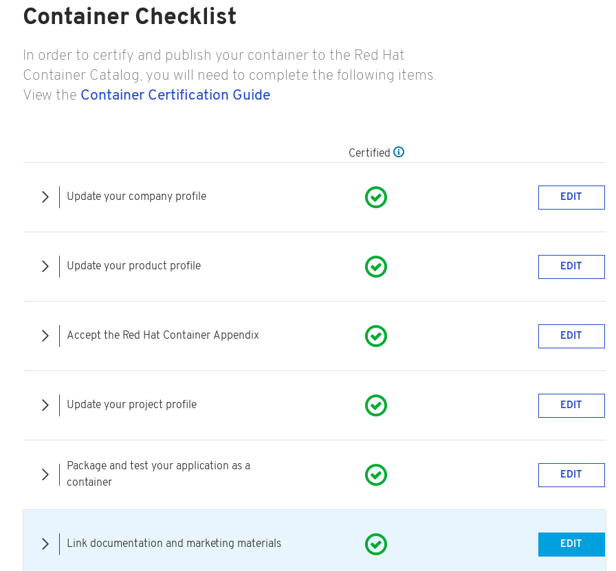
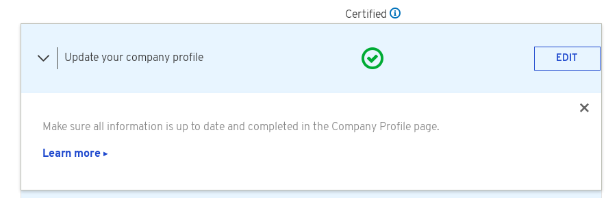

# The Certification Checklist

Certified containers are applications that meet Red Hat’s best practices for packaging, distribution and maintenance. Certified containers imply a commitment from partners to maintain their images up to date and represent the highest level of trust and supportability for Red Hat customers container-capable platforms, including OpenShift.

For Container Certification, you will need to complete the Certified section of the checklist and publish the image. To find the checklist for your certification project, go to your project page and select Certification Checklist located on the left menu under Actions.

An example of Container Checklist in progress:

The certified container will be published in the [Red Hat Container Catalog](https://access.redhat.com/containers/) along with containers published by Red Hat and those published by other software companies. The Red Hat Container Catalog is the public-facing website that showcases the containerized applications suitable for enterprise consumption. Red Hat Container Catalog pages will allow for publishing information about the partner company, and company’s products, as well as technical information about the containerized application. There will also be a way to link in assets from the partner company \(by URL\) that provide additional information about the product, for example a datasheet, a solution brief, a pre-recorded webinar, a case study, etc. The data populating the Red Hat Container Catalog is sourced from the Connect site. Therefore, it is important to review the company and product entries on Connect prior to publishing the container to Red Hat Container Catalog.

Before your image gets published you must complete the Certification Checklist. Once all items are completed and your image has passed the scan, you will be able to publish to the Red Hat Container Catalog.

Each item on the Checklist has more information, you can select the drop down arrow located to the left of each item to Learn More.

The checklist is separated into the following sections:

* Update your company profile
  * This page is to ensure that your company profile is up to date. Edit if necessary.
* Update your product profile
  * This page relates to the product’s profile such as product type, description, repository URL, version, contact distribution list, etc.
* Accept the Red Hat Container Appendix
  * Site Agreement to the Container Terms.
* Update project profile
  * This section relates more to the image/container settings such as Auto Publish feature, registry namespace, release category, supported platforms.
* Package and test your application as a container
  * Follow the instructions on this page to configure the build service. The build service will be dependent on the complete of the previous steps.
* Upload documentation and marketing materials
  * This will bring you to the product page. Scroll to the bottom and click on Add new Collateral to upload your product information.


A minimum of 3 materials are required, with 1 being a mandatory “document” type. This is where you add your product information to your product page.


* Provide a container registry namespace
  * This is the same as the project page profile page.
* Provide sales contact information
  * Again, this information is the same as the company profile.
* Obtain distribution approval from Red Hat
  * Red Hat will take care of this step.

