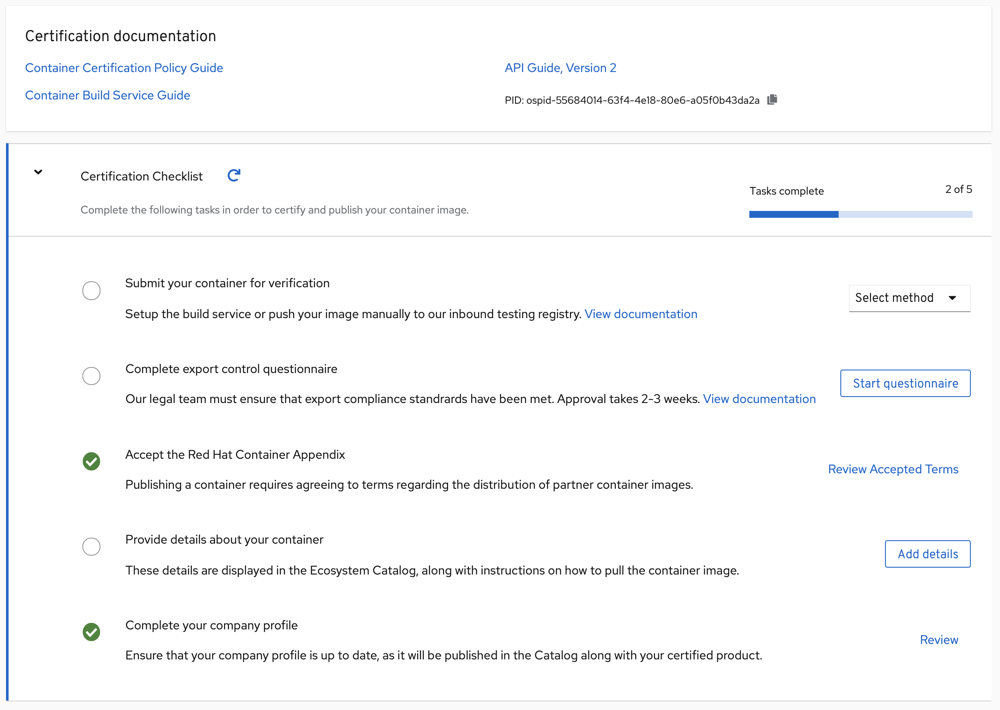

# The Certification Checklist

Certified containers are applications that meet Red Hat’s best practices for packaging, distribution and maintenance. Certified containers imply a commitment from partners to maintain their images up to date and represent the highest level of trust and supportability for Red Hat customers container-capable platforms, including OpenShift.

For Container Certification, you will need to complete the Certified section of the checklist and publish the image. To find the checklist for your certification project, go to your project page and click the 'Overview' tab on the certification project header menu.

An example of Container Checklist in progress:

The certified container will be published in the [Red Hat Container Catalog](https://access.redhat.com/containers/) along with containers published by Red Hat and those published by other software companies. The Red Hat Container Catalog is the public-facing website that showcases the containerized applications suitable for enterprise consumption. Red Hat Container Catalog pages will allow for publishing information about the partner company, and company’s products, as well as technical information about the containerized application. There will also be a way to link in assets from the partner company \(by URL\) that provide additional information about the product, for example a datasheet, a solution brief, a pre-recorded webinar, a case study, etc. The data populating the Red Hat Container Catalog is sourced from the Connect site. Therefore, it is important to review the company and product entries on Connect prior to publishing the container to Red Hat Container Catalog.

Before your image gets published you must complete the Certification Checklist. Once all items are completed and your image has passed the scan, you will be able to publish to the Red Hat Container Catalog.

The checklist is separated into the following sections:

* Submit your container for verification
  * Setup the build service or push your image manually to our inbound testing registry.
* Complete export control questionnaire \(for container images only\)
  * Red Hat will take care of this step.
* Accept the Red Hat Container Appendix
  * Site Agreement to the Container Terms.
* Provide details about your container
  * This section relates more to the image/container settings such as Auto Publish feature, registry namespace, release category, supported platforms.
* Complete your company profile
  * This page is to ensure that your company profile is up to date. Edit if necessary.
* Select your OperatorHub Listing \(for operator bundles only\)
  * This section lets you specify catalog distribution for your operator

