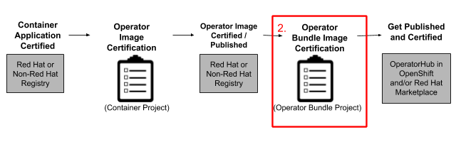

# Certify your Operator Bundle


Certified Operators are listed in and consumed by customers through the embedded OpenShift OperatorHub, providing them the ability to easily deploy and run your solution. Additionally, your product and Operator image will be listed in the [Red Hat Container Catalog ](https://catalog.redhat.com)using the listing information you provide.‌&#x20;


Once you have certified your Operator image you can continue to the last step for Operator Certification.&#x20;

### 2. Operator Bundle Image Certification&#x20;

Once this section is complete, you will be able to publish your Operator in OpenShift embedded OperatorHub and, if desired, the Red Hat Marketplace powered by IBM.&#x20;


Documentation for Operator Bundle Image Certification has moved to: [Red Hat OpenShift Certification Workflow Guide](https://access.redhat.com/documentation/en-us/red\_hat\_openshift\_certification/4.9/html/red\_hat\_openshift\_software\_certification\_workflow\_guide/index)

