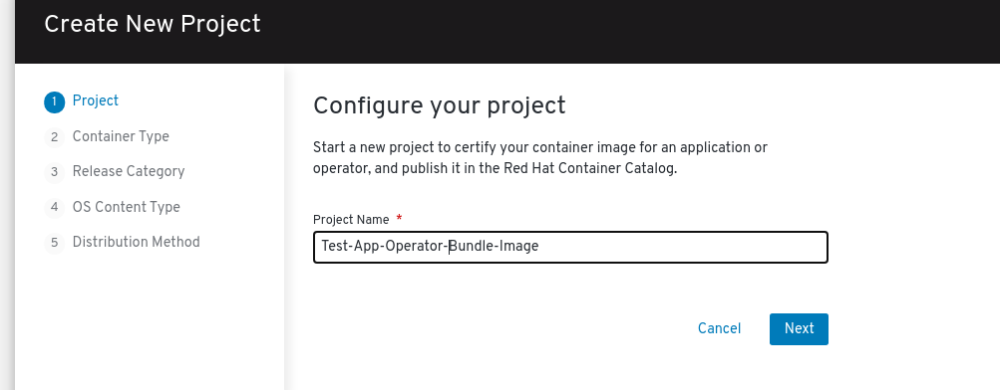
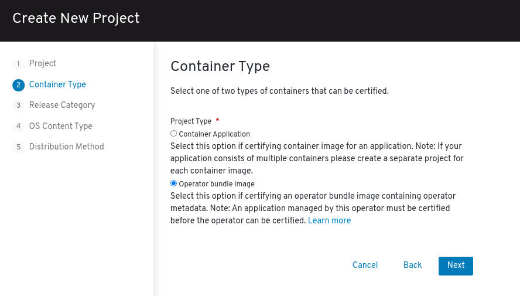
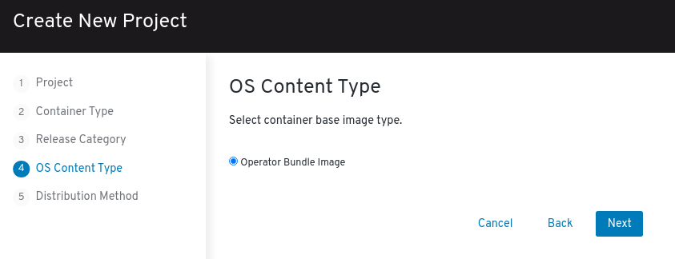
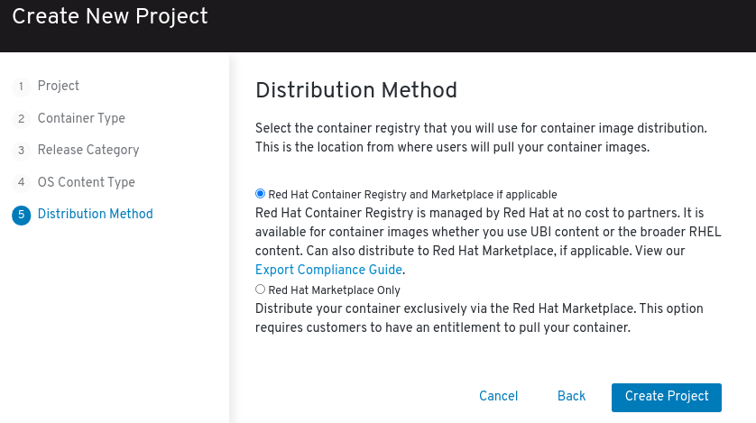
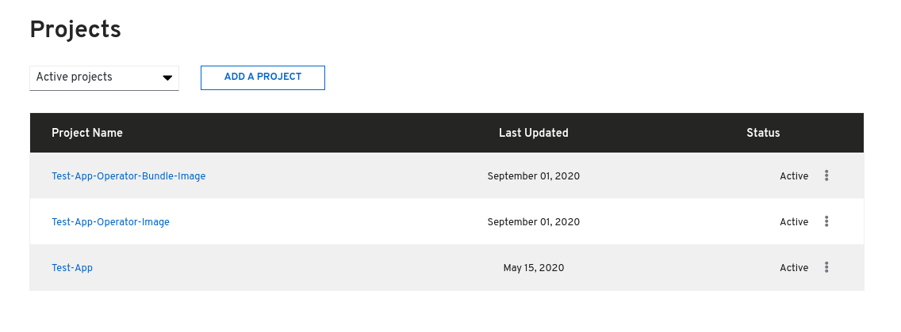

# Creating Operator Bundle Image Project

The second step to completing a certified operator is certifying your operator bundle image. To certify your operator image you must create a _**Operator Bundle Image Project**_. 

Click **ZONES & RESOURCES** at the top of the page and click **Red Hat OpenShift & containers**

Click _**CERTIFY**_ 

Scroll down to Projects section and Click **ADD A PROJECT**.‌

Complete the Create New Project Wizard.

## 1. Project

## 2. Container Type

Select **Operator bundle image**

## 3. Release Category

## 4. OS Content Type

## 5. Distribution Method


This information cannot be changed after project is created

* Red Hat Connect & Marketplace
  * This option will publish to both embedded OperatorHub and if applicable Red Hat Marketplace
* Red Hat Marketplace Only
  * This option will only show up in Red Hat Marketplace and not in any embedded OperatorHub


Once you have finalized all your selection click on **Create Project.**


To access your project:   
➡ Click the Project Name in the Zone \[Red Hat Openshift & Container\] &gt; Certify Page.   
➡ You can also access your projects by going to Product Certification&gt; Manage projects 


