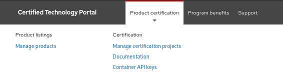
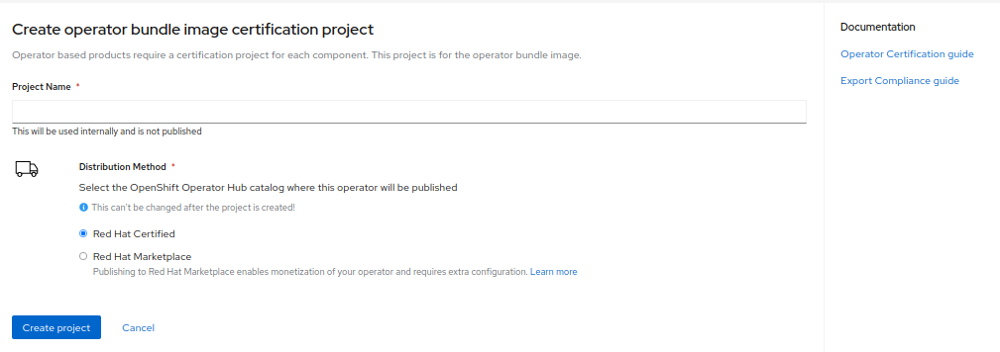

# Creating Operator Bundle Image Project

The second step to completing a certified operator is certifying your operator bundle image. To certify your operator image you must create a _**Operator Bundle Image Project**_

Click **PRODUCT CERTIFICATION** at the top of the page and click** Manage certification projects**

Click _**Create Project**_&#x20;

Select _Red Hat OpenShift_ in the modal then click **NEXT.**‌

Select _Operator Bundle image_ in the modal then click **NEXT**.‌

Provide the required information to create your project.

## 1. Project Name

## 2. Distribution Method


This information cannot be changed after project is created

* Red Hat Certified&#x20;
* Red Hat Marketplace

If you are certifying for both options you will need to create 2 separate projects.&#x20;

**Note**: Think carefully about your desired distribution method and where you want your Operator to be listed. We do not recommend creating two separate projects as this means you will have two separate listings within OperatorHub and our Red Hat Container Catalog, and both Operators will need to be maintained over time.


Once you have finalized all your selection click on **Create project.**


To access your project, go to Product Certification > Manage certification projects&#x20;


