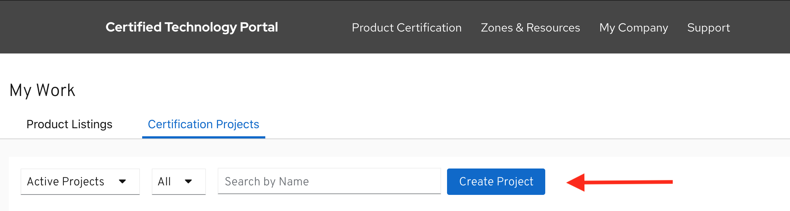

# Creating Operator Bundle Image Project

The second step to completing a certified operator is certifying your operator bundle image. To certify your operator image you must create a _**Operator Bundle Image Project**_. 

Click **PRODUCT CERTIFICATION** at the top of the page and click **Manage projects**

Click _**Create Project**_ 

Select _Red Hat OpenShift_ in the modal then click **NEXT.**‌

Select _Operator Bundle image_ in the modal then click **NEXT**.‌

Provide the required information to create your project.

## 1. Project Name

## 2. Distribution Method


This information cannot be changed after project is created

* Red Hat Connect & Marketplace
  * This option will publish to both embedded OperatorHub and if applicable Red Hat Marketplace


Once you have finalized all your selection click on **Create project.**


To access your project, go to Product Certification &gt; Manage projects 


