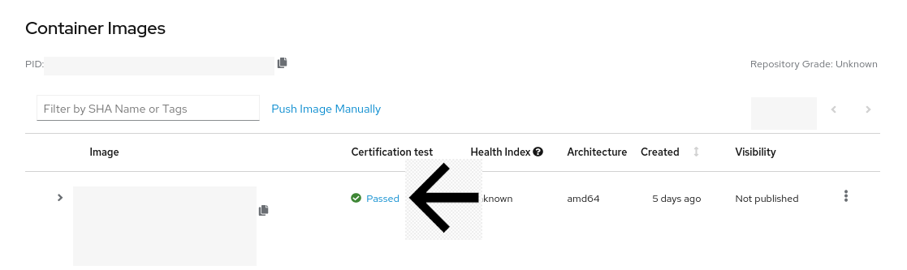
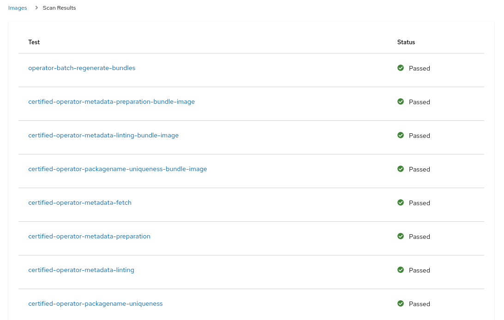
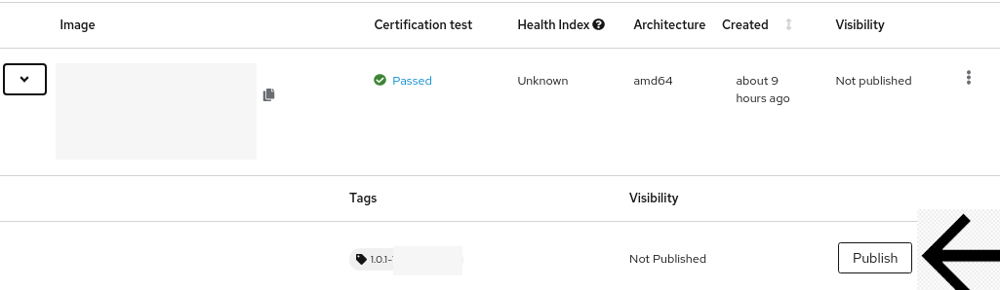

# Bundle Image Scan & Results

The Scan takes about 1-2 hours. You can see the update of the Scan in the Certification Test column. Once the scan has completed you will see a Passed or Failed Status in the Certification Test column. Example of a Passed Image: 

To view more information on the Scan Results click on the status of the image in the Certification Test Column.

Here you can see which test passed/failed.  An example of Scan Results:

If the checklist is completed and your Bundle Image has Passed Results, you can Publish your Image. To Publish your Image, you can click the dropdown arrow next to the image and select Publish. 


If your image is taking longer than 2 hours to scan or if you need help troubleshooting any failure, please open a Support Ticket and an engineer will be in contact with you shortly. Instructions on how to open a Support Ticket can be found in the [Getting Help](https://redhat-connect.gitbook.io/red-hat-partner-connect-general-guide/managing-your-account/getting-help/support-ticket) Section.


