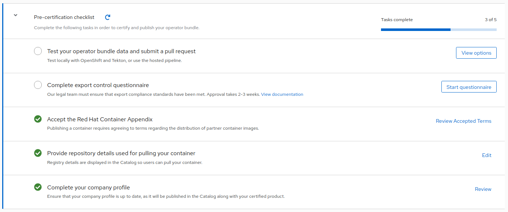

# The Certification Checklist

For the Operator Bundle Image Certification, you will need to complete the Certified section of the checklist and publish the image. To find the checklist for your certification project, go to your project page and select Overview located on the header for that project.

An example of a Checklist in progress:

Before your bundle gets published you must complete the Certification Checklist. Once all items are completed and your image has passed the scan, you will be able to publish to OpenShift OperatorHub and/or Red Hat Marketplace.

The checklist is separated into the following sections:

* Test your operator bundle data and submit a pull request
  * Test locally with OpenShift and Tekton; instructions found: [HERE](https://github.com/redhat-openshift-ecosystem/certification-releases/blob/main/4.9/ga/ci-pipeline.md#operator-certification-ci-pipelineinstructions).&#x20;
* Complete export control questionnaire
  * Our legal team must ensure that export compliance standards have been met. Approval takes 2-3 weeks.
* Accept the Red Hat Container Appendix
  * Publishing a container requires agreeing to terms regarding the distribution of partner container images.
* Provide repository details used for pulling your container
  * Registry details are displayed in the Catalog so users can pull your container.
* Complete your company profile
  * Ensure that your company profile is up to date, as it will be published in the Catalog along with your certified product.
