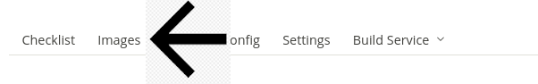
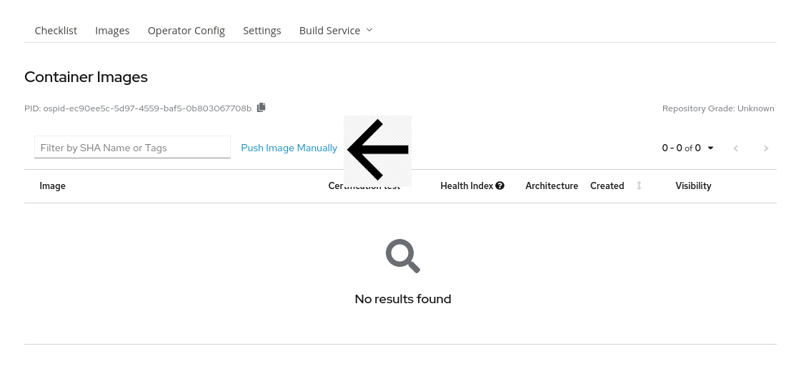
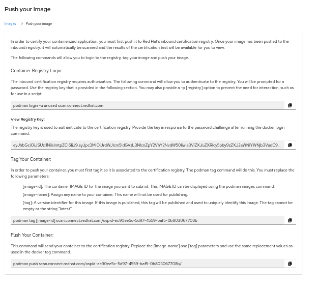
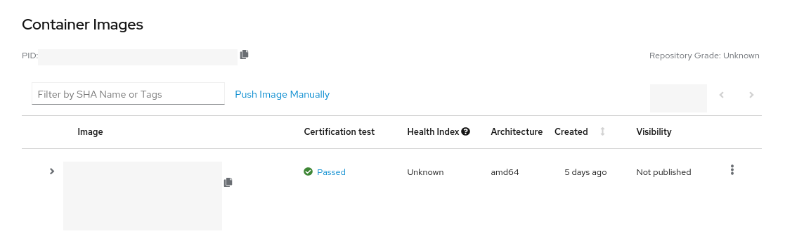

# Uploading your Operator Bundle Image


Make sure to take a look at the [Technical Prerequisites](https://redhat-connect.gitbook.io/partner-guide-for-red-hat-openshift-and-container/program-on-boarding/technical-prerequisites) section to validate that your Dockerfile will pass our certification scan.


## Manually Upload Your Image <a id="manually-upload-your-image"></a>

If you haven't done so already, click on Images on the upper header of the project.



Click on Push Image Manually and follow the instructions.



Copy the Registry Login Command

```text
podman login -u unused scan.connect.redhat.com
```

When prompted for a password, use the Registry Key in this page 


This Registry Key is unique per project, please make sure you are using the correct password for the project you are working on.

If you do not have a registry key populated or are having issues pushing your image please open a Support Ticket. Instructions on how to open a Support Ticket can be found in the [Getting Help](https://redhat-connect.gitbook.io/red-hat-partner-connect-general-guide/managing-your-account/getting-help/support-ticket) Section.


Once you have successfully logged in, you can Tag and Push your Image following the instructions on your project page. An example Push your Image page: 



Once you have pushed your image you can click on **Images** in the top header again and after a few minutes you will notice your Image will show up. Example:



