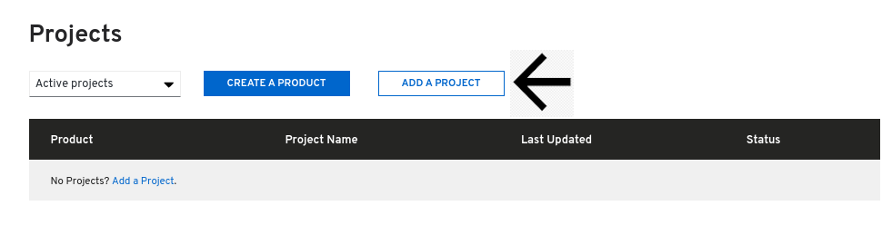
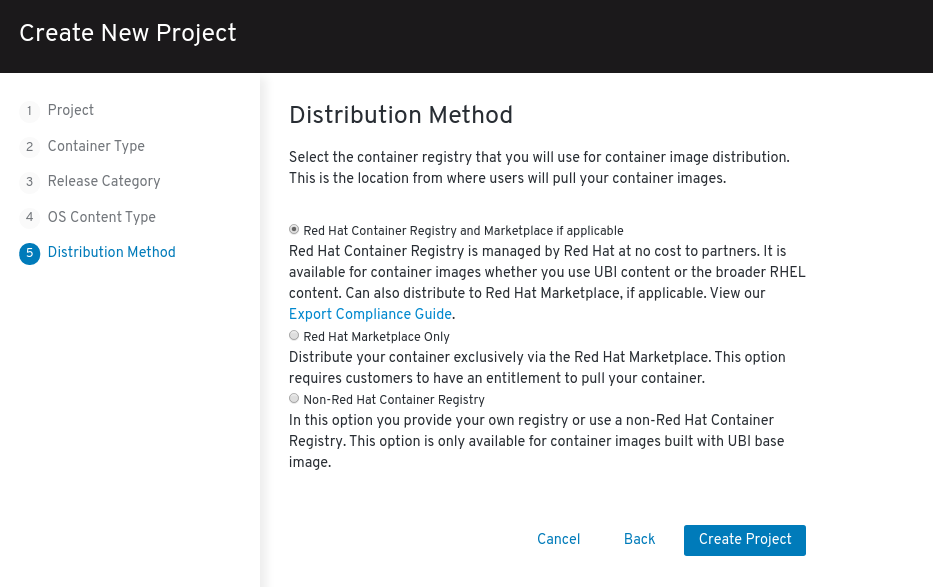

# Creating an operator project


Certified operators are listed in and consumed by customers through the embedded OpenShift OperatorHub, providing them the ability to easily deploy and run your solution. Additionally, your product and operator image will be listed in the [Red Hat Container Catalog ](https://catalog.redhat.com)using the listing information you provide.‌ 


Click **ZONES & RESOURCES** at the top of the page and click **Red Hat OpenShift & containers**

Click _**CERTIFY**_ 

Scroll down to Projects section and Click **ADD A PROJECT**.‌

Complete the Create New Project Wizard.

## 1. Product

## 2. Container Type

Select **OPERATOR**

## 3. Release Category

## 4. OS Content Type


This information cannot be changed after project is created


## 5. Distribution Method


This information cannot be changed after project is created

_If this is for the Red Hat Marketplace, you **cannot** choose Non-Red Hat Container Registry. You have the other 2 options to chose from and must complete_ [_Export Compliance_](https://redhat-connect.gitbook.io/red-hat-partner-connect-general-guide/initial-onboarding/export-compliance)_._ 


Once you have finalized all your selection click on **Create Project.**


To access your project:   
➡ Click the Project Name in the Zone \[Red Hat Openshift & Container\] &gt; Certify Page.   
➡ You can also access your projects by going to Company Dashboard &gt; Scroll down to Zones and click View Projects. 


