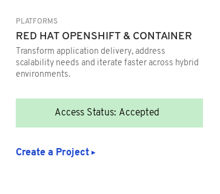
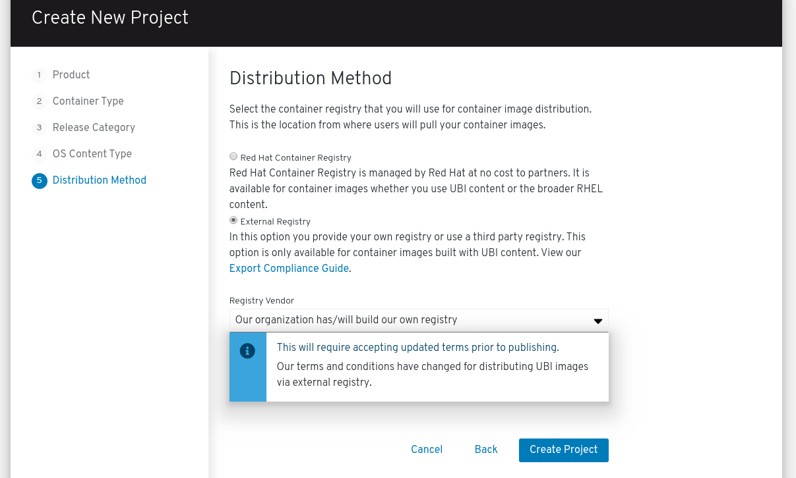

# Creating an Operator Project


Certified operators are listed in and consumed by customers through the embedded OpenShift OperatorHub, providing them the ability to easily deploy and run your solution. Additionally, your product and operator image will be listed in the Red Hat Container Catalog using the listing information you provide.‌


From the [Red Hat Partner Connect web portal](https://connect.redhat.com/), select **ZONES** at the top of the page.‌

Scroll down to the RED HAT OPENSHIFT & CONTAINER zone and click **CREATE A PROJECT**.‌

Complete the Create New Project Wizard. 

### 1. Product 

### 2. Container Type 

Select **Operator**

### 3. Release Category

### 4. OS Content Type 


This information cannot be changed after project is created. If you used the Operator-SDK to build your operator, select **Red Hat Universal Base Image \(UBI\)**. 


### 5. Distribution Method


This information cannot be changed after project is created


Once you have finalized all your selection click on **Create Project.** 

