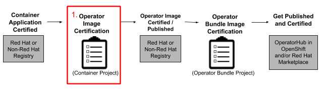

# Certify your Operator Image


Certified Operators are listed in and consumed by customers through the embedded OpenShift OperatorHub, providing them the ability to easily deploy and run your solution. Additionally, your product and Operator image will be listed in the [Red Hat Container Catalog ](https://catalog.redhat.com)using the listing information you provide.‌ 


Once you have certified your container application(s); you can move onto Building your Operator. Once that is complete you can continue the Operator Certification. The first step for Operator Certification is Certifying your Operator Image: 

### 1. Operator Image Certification 

This section needs to be completed before the next step. Once your Operator image certification is complete you will be able to publish the image to Red Hat or Non-Red Hat Container Registry. 
