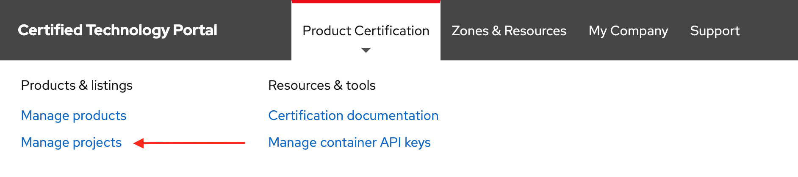
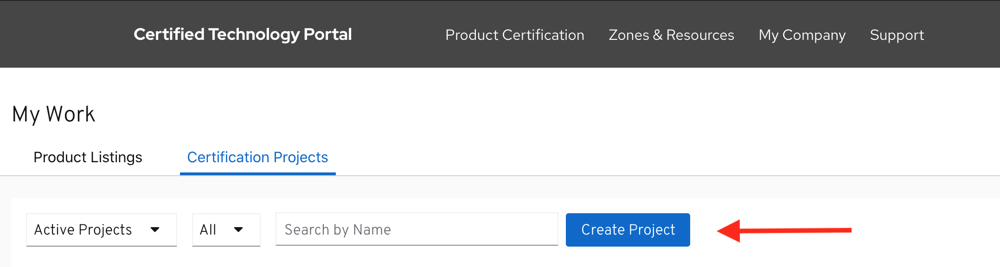
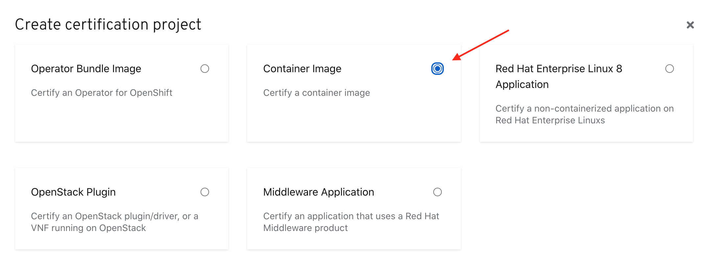

# Creating Container Project

Click **PRODUCT CERTIFICATION** at the top of the page and click **Manage projects**

Click _**Create Project**_ 

Select _Container image_ in the modal then click **NEXT.**‌

Complete the Create New Project Wizard.

## 1. Project

## 2. Container Type

Select **Container Application**

## 3. Release Category

## 4. OS Content Type


This information cannot be changed after project is created


## 5. Distribution Method


This information cannot be changed after project is created

_If this is for the Red Hat Marketplace, you **cannot** choose Non-Red Hat Container Registry. You have the other 2 options to chose from and must complete_ [_Export Compliance_](https://redhat-connect.gitbook.io/red-hat-partner-connect-general-guide/initial-onboarding/export-compliance)_._ 


Once you have finalized all your selection click on **Create Project.**


To access your project, go to Product Certification &gt; Manage projects 


