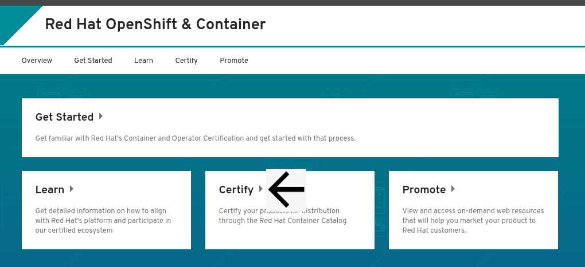
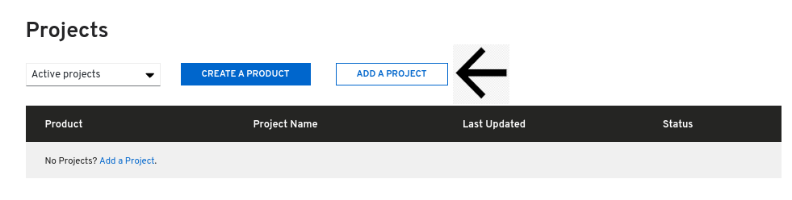
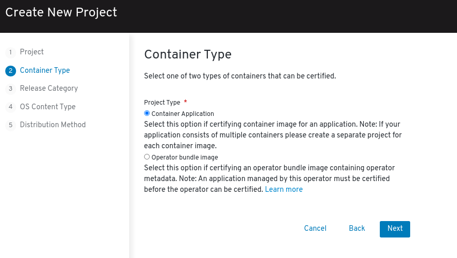
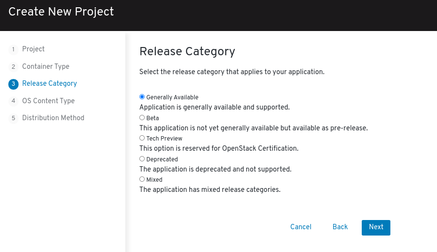
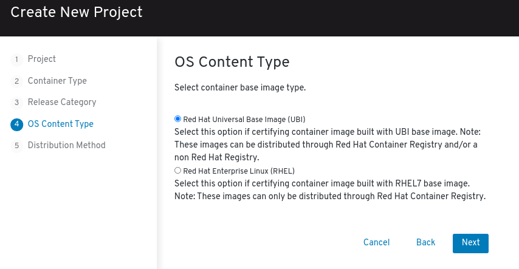
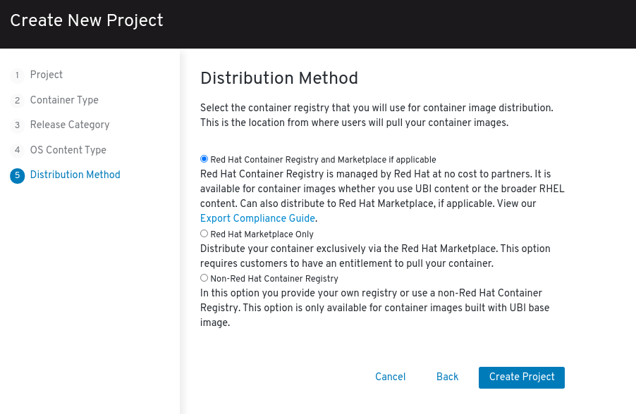
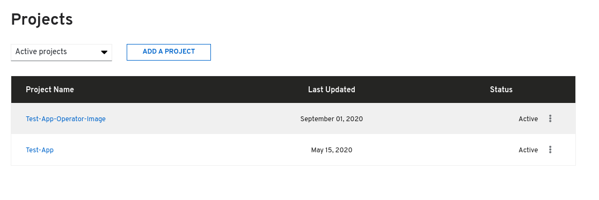

# Creating Container Project

Click **ZONES & RESOURCES** at the top of the page and click **Red Hat OpenShift & containers**

Click _**CERTIFY**_ 

Scroll down to Projects section and Click **ADD A PROJECT**.‌

Complete the Create New Project Wizard.

## 1. Project

## 2. Container Type

Select **Container Application**

## 3. Release Category

## 4. OS Content Type


This information cannot be changed after project is created


## 5. Distribution Method


This information cannot be changed after project is created

_If this is for the Red Hat Marketplace, you **cannot** choose Non-Red Hat Container Registry. You have the other 2 options to chose from and must complete_ [_Export Compliance_](https://redhat-connect.gitbook.io/red-hat-partner-connect-general-guide/initial-onboarding/export-compliance)_._ 


Once you have finalized all your selection click on **Create Project.**


To access your project:   
➡ Click the Project Name in the Zone \[Red Hat Openshift & Container\] &gt; Certify Page.   
➡ You can also access your projects by going to Product Certification&gt; Manage projects 


