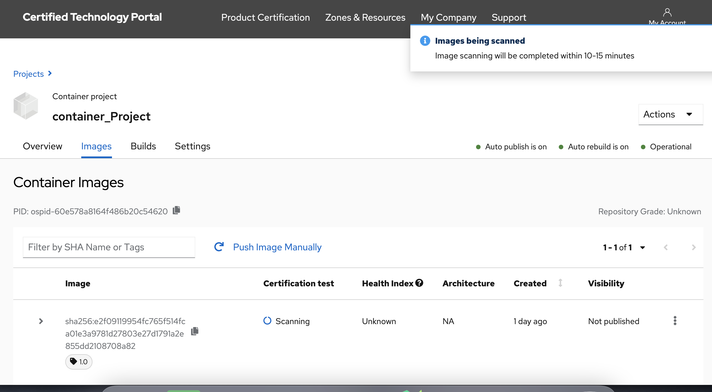

# Image Scanning and Verification

## Image Scan

After the image has completed being uploaded, the image will display “Scanning” in the “Certification test” column and a notification will be displayed in the upper right side of the page.


It may be necessary to refresh the browser page to see the current status.


Once the image has completed the scan in Red Hat Connect repository, the image will show the results of the scan. Scans normally take about 10-15 minutes to complete.

The "Passed" or "Failed" Certification test link will expand on the scan results. Expanding the row will reveal the “Publish” button, which will publish the image to the Red Hat Container Catalog. It will change to “Unpublish” once and image has been published. The “Delete tag” option in the right hand menu allows you to remove a tag that you do not want to use or need anymore.

## Image Verification


If the image returns a Passed scan status but the Publish button is still blocked, verify that you have completed the Certification Checklist.


If the image returns a “Failed” scan status, the results will automatically be displayed. Click on the name of the failed item \(in this example, “has\_licenses”\) for reference to the policy guide.


If you receive an **Access Denied** response when accessing the Policy Guide, please open a Support Ticket. Instructions on how to open a Support Ticket can be found in the [Getting Help](https://redhat-connect.gitbook.io/red-hat-partner-connect-general-guide/managing-your-account/getting-help/support-ticket) Section.


