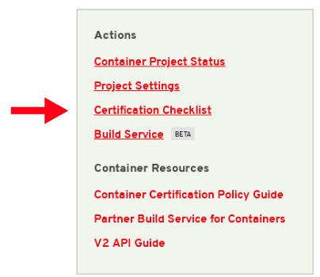

# The Certification Checklist

For Operator Image Certification, you will need to complete the Certified section of the checklist and publish the image. To find the checklist for your certification project, go to your project page and select Certification Checklist located on the left menu under Actions.

An example of a Checklist in progress:

Before your image gets published you must complete the Certification Checklist. Once all items are completed and your image has passed the scan, you will be able to publish to the Red Hat Container Catalog or a Non-Red Hat Registry.

Each item on the Checklist has more information, you can select the drop down arrow located to the left of each item to Learn More.

The checklist is separated into the following sections:

* Update your company profile
  * This page is to ensure that your company profile is up to date. Edit if necessary.
* Accept the Red Hat Container Appendix
  * Site Agreement to the Container Terms.
* Update project profile
  * This section relates more to the image/container settings such as Auto Publish feature, registry namespace, release category, supported platforms.
* Package and test your application as a container
  * Follow the instructions on this page to configure the build service. The build service will be dependent on the complete of the previous steps.
* Provide a container registry namespace
  * This is the same as the project page profile page.


If you have decided to use a Non-Red Hat registry, when updating the _**Repository Path**_ make sure you include registry url, namespace and image only. Do not include the tag name or version of the image.    
  
Example for Repository Path: _**quay.io/test\_partner/test-image**_


* Provide sales contact information
  * Again, this information is the same as the company profile.
* Obtain distribution approval from Red Hat
  * Red Hat will take care of this step.

