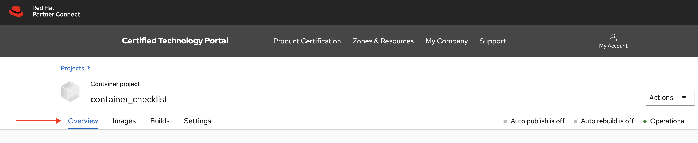
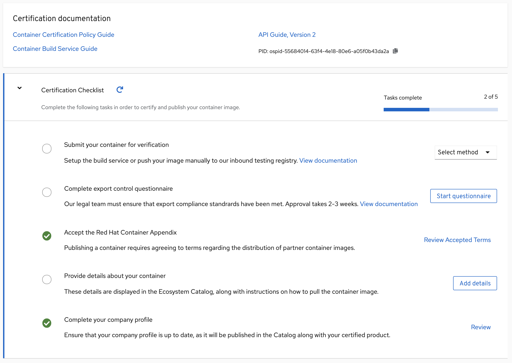

# The Certification Checklist

For Operator Image Certification, you will need to complete the Certified section of the checklist and publish the image. To find the checklist for your certification project, go to your project page and select Certification Checklist located on the left menu under Actions.

An example of a Checklist in progress:

Before your image gets published you must complete the Certification Checklist. Once all items are completed and your image has passed the scan, you will be able to publish to the Red Hat Container Catalog or a Non-Red Hat Registry.

The checklist is separated into the following sections:

* Submit your container for verification
  * Push your image manually to our inbound testing registry.
* Complete export control questionnaire (for container images only)
  * Red Hat will take care of this step.
* Accept the Red Hat Container Appendix
  * Site Agreement to the Container Terms.
* Provide details about your container
  * This section relates more to the image/container settings such as Auto Publish feature, registry namespace, release category, supported platforms.
* Complete your company profile
  * This page is to ensure that your company profile is up to date. Edit if necessary.
