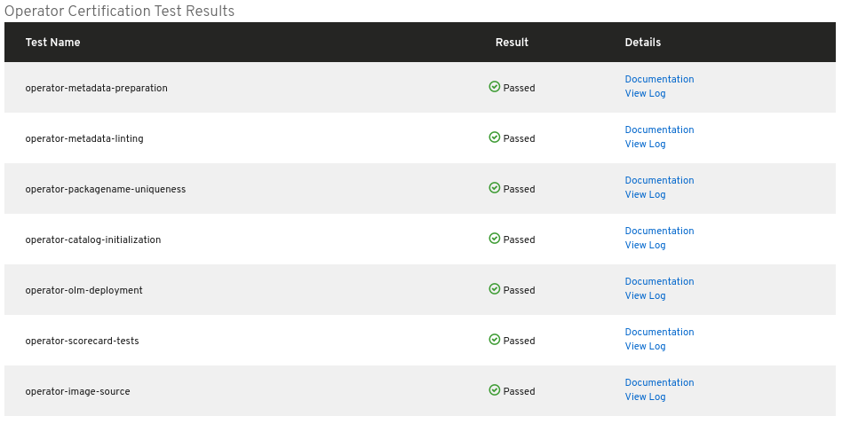
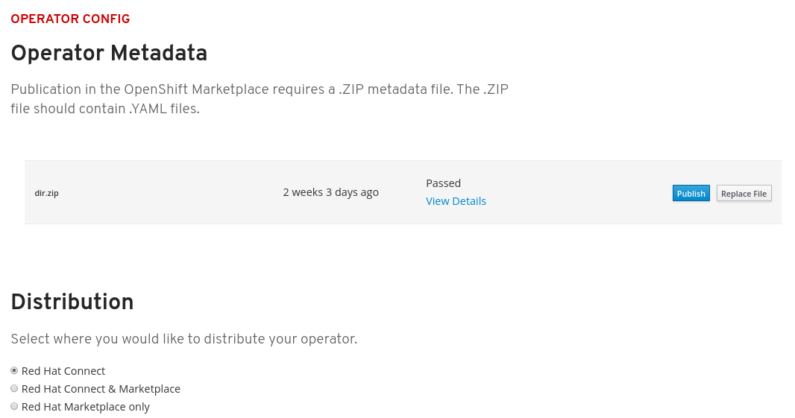

# Metadata scanning & results

The Metadata Scan takes about 1-2 hours. Once the scan is complete you will see the Results under Operator Metadata. If you have a Passed result you can click **Publish** to Publish your Operator.

Click **View Details** to see further results and logs.


If your image is taking longer than 2 hours to scan or if you need help troubleshooting any failure, please open a Support Ticket and an engineer will be in contact with you shortly. Instructions on how to open a Support Ticket can be found in the [Getting Help](https://redhat-connect.gitbook.io/partner-guide-for-red-hat-openshift-and-container/tools-and-resources/getting-help) Section.


### Distribution

You can now select where to distribute your Operator. Once you are ready to publish your operator, select an option before hitting Publish. This can also be found in the Operator Config section. 

