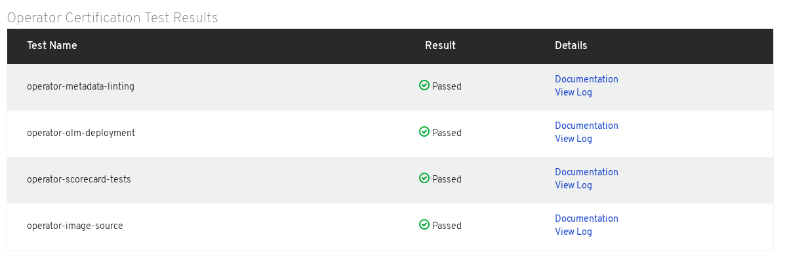

# Metadata Scan and Results

The Metadata Scan takes about 1-2 hours. Once the scan is complete you will see the Results under Operator Metadata. If you have a Passed result you can click **Publish** to Publish your Operator.

Click **View Details** to see further results and logs.

