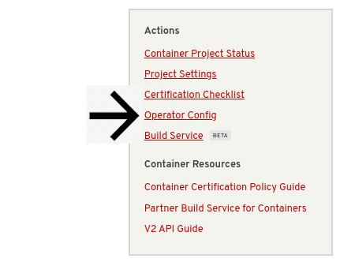
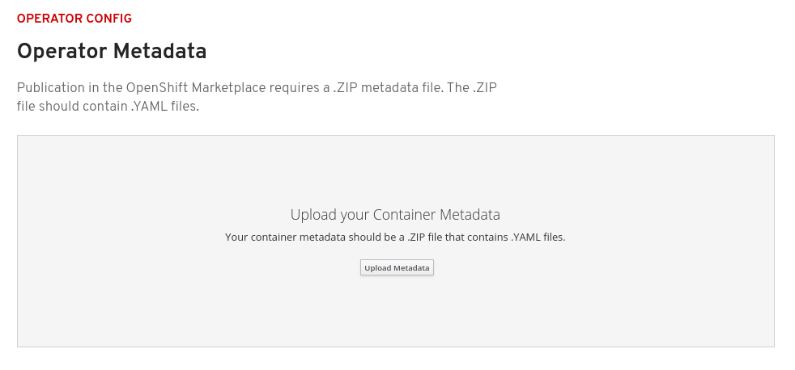

# Operator Config


If you need assistance creating your metadata you can use [https://operatorhub.io/bundle](https://operatorhub.io/bundle) to manually enter the information. The metadata can also be constructed using the Operator-SDK CLI. More information can be found: [Operator Metadata](https://redhat-connect.gitbook.io/certified-operator-guide/ocp-deployment/operator-metadata)



Make sure your Operator Image is **Certified and Published** before you Upload your Metadata. This information must be added to the CSV file; instructions found: [Creating the ClusterServiceVersion](https://redhat-connect.gitbook.io/certified-operator-guide/ocp-deployment/operator-metadata/creating-the-csv#fields-to-add-under-metadata-annotations). 


In your Project Page, click on **Operator Metadata** on the left hand box.

Publication in the OpenShift Marketplace requires a .ZIP metadata file. The .ZIP file should ONLY contain the following .YAML files: CSV, CRD, and Package Manifest. All other files added will cause the scan to fail.


For further questions or information regarding the files required or if you need assistance creating these files please open a Support Ticket. Instructions can be found in the [Getting Help Section](https://redhat-connect.gitbook.io/partner-guide-for-red-hat-openshift-and-container/tools-and-resources/getting-help). 


Once you have your .ZIP file ready you can upload it by clicking Upload Metadata.

Once upload is complete, scanning will begin. This may take up to 1 hour to complete.

