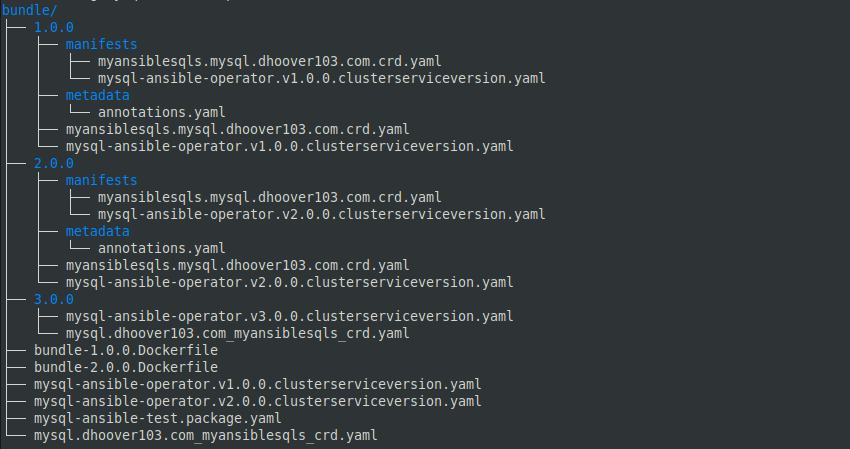
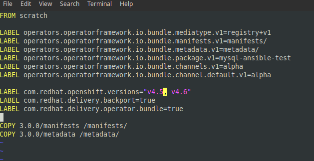

# Upgrading your Operator

To create a new update for your operator, you'll need to create a new version directory, and place your crds and csv inside. You can make any updates to these files as normal. 

```text
$ mkdir bundle/3.0.0
$ cp <latest csv> bundle/3.0.0
$ cp <crd> bundle/3.0.0
```

Here's an example what the structure should look like when you're done:




Don't forget to update your package yaml, too! It's not in one of the version sub-directories because the package determines which operator version is used.


Move into the bundle directory. You can now use opm to create the annotations.yaml and Dockerfile. Keep in mind that the new Dockerfile will be created in the directory you run the command, and it includes COPY commands. It'll also slightly re-scaffold the project.

```text
$ cd bundle
$ opm alpha bundle generate -d ./3.0.0/ -u ./3.0.0/
```

Next, you'll need to add some LABELs to the Dockerfile.

```text
LABEL com.redhat.openshift.versions="v4.5, v4.6"
LABEL com.redhat.delivery.backport=true
LABEL com.redhat.delivery.operator.bundle=true
```

 When you're done, the finished Dockerfile should look something like this



Now you can build the new image and submit it to the pipeline. 

