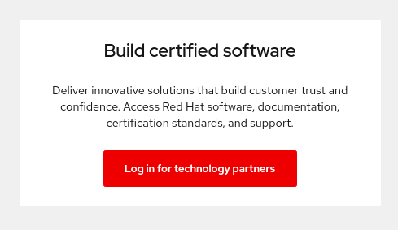
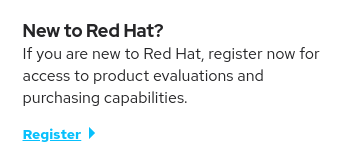

# Register & Request Technology Partnership

From the [Red Hat Partner Connect web portal](https://connect.redhat.com/), **LOG IN** at the upper right of the page.

Click **Log in for technology partner**.

If you have a Red Hat account with your company, Log In. If you do not, click **Register** under New to Red Hat?


If you believe your company has an existing account and are not sure who is the Org Admin for your company, please email connect@redhat.com to find out, so they can add you to the existing account.


Fill in all required fields and SUBMIT.

An email verification will be sent to the email address provided. Once you verify your email address, log in to the [Red Hat Partner Connect web portal](https://connect.redhat.com/). 


To log in, Click Log In in the upper right corner and Log In for Technology Partners


Fill out the Getting Started questionnaire. 

Once the Profile section is complete, review and accept the Technology Partner Program Agreement.

