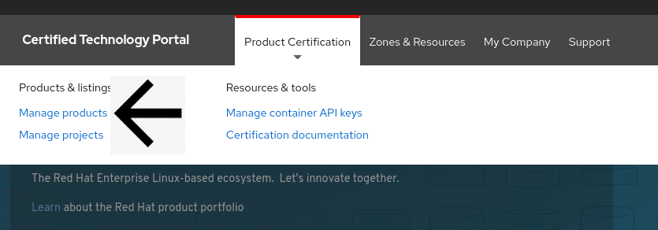
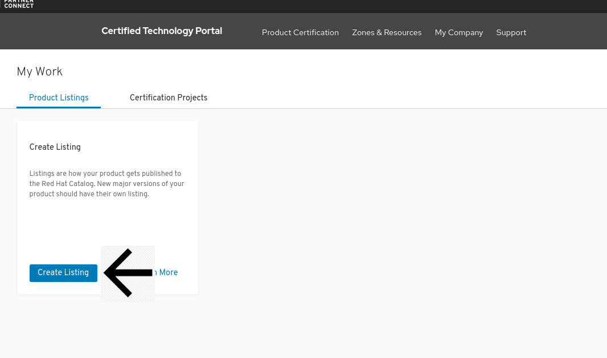
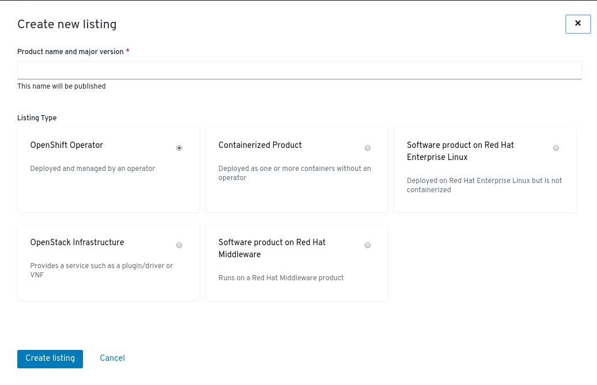
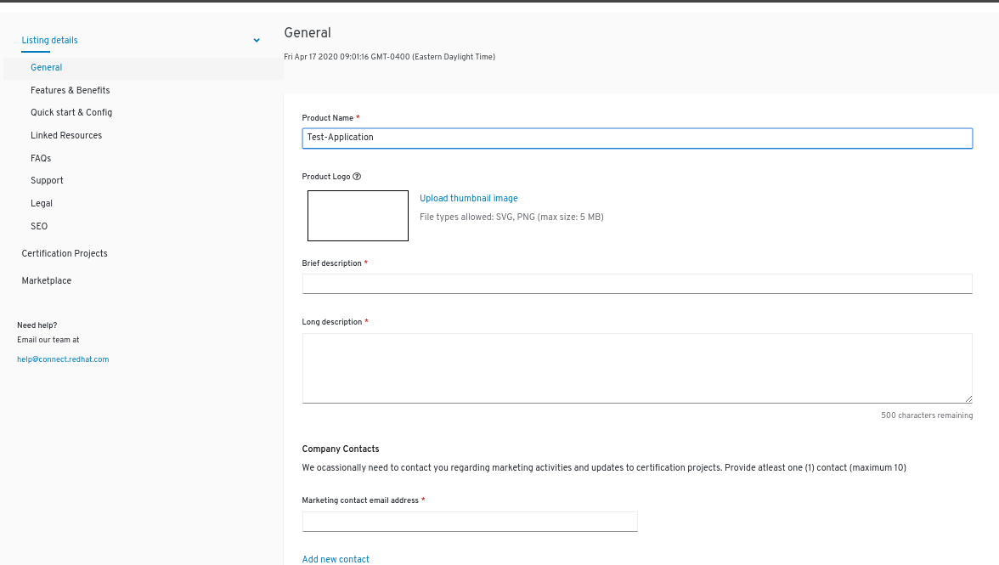
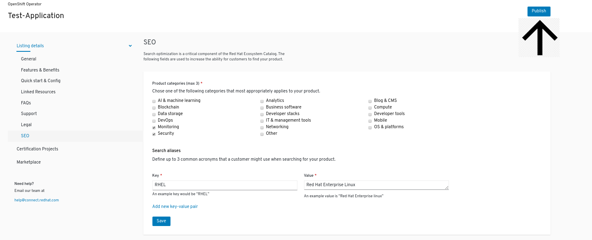

# Add a Product

From the [Red Hat Partner Connect web portal](https://connect.redhat.com/), click on **Product Certification** at the top menu bar of the page and select **MANAGE PRODUCTS.** 

Click **CREATE LISTING**.

Fill in the Product name and Version and Listing Type and click **CREATE LISTING.**

Once Listing is created, Fill in all the required fields and click **CREATE LISTING.**


You must go through each _Listing details_ in the left hand menu and fill out all required information. 


Once all required information is filled out, you can click **PUBLISH** on the right upper corner to publish your Product Listing. 


The product information you enter will be used to feed the certified product catalog after certification is complete and approved by Red Hat, therefore verify all information is correct.


