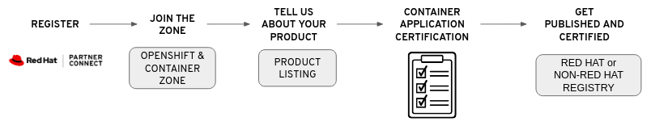
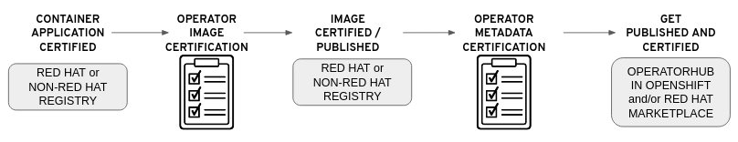

# Certification Workflow

This guide will go through the Certification Process for the Red Hat OpenShift and Container Zone in Red Hat Connect. There are 2 types of Certifications: 

1. Container Application 
2. Operator 

In order to have a Certified Operator, you must first complete the Container Application Certification for all the applications you will be deploying with your operator. 

### Container Application Certification Workflow

### Operator Certification Workflow


Other IBM Partners program can be pursued after both certification workflows have been completed. More information can be found here: IBM Partner Programs. 


