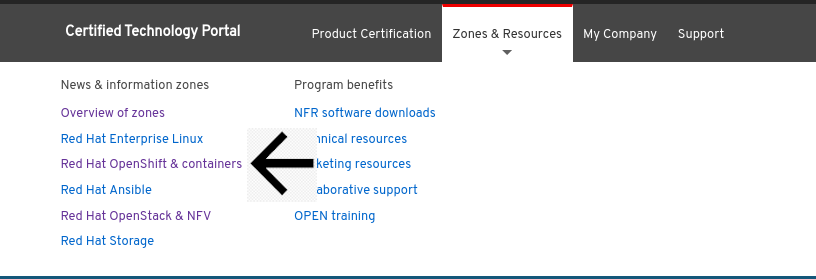
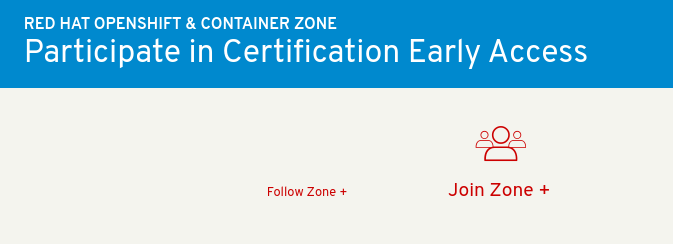

# Request Container Zone Access

When you’re ready to certify your product on Red Hat Software, you will need to request Zone access and then create a Certification Project.

From the [Red Hat Partner Connect web portal](https://connect.redhat.com/), click **LOG IN** at the upper right of the page and click **Log In for technology partners**.

Click on **My Account** and click on **Company Dashboard**

Then select **EDIT COMPANY PROFILE**

Complete all mandatory fields marked with an asterisk\(\*\) and then click **SUBMIT** at the end of the page

Click **ZONES & RESOURCES** at the top of the page and click **Red Hat OpenShift & containers**

Click **JOIN ZONE**.

