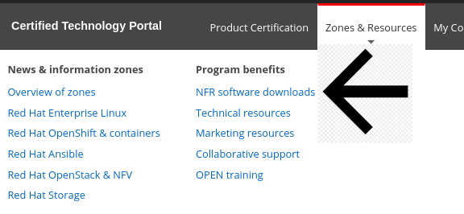
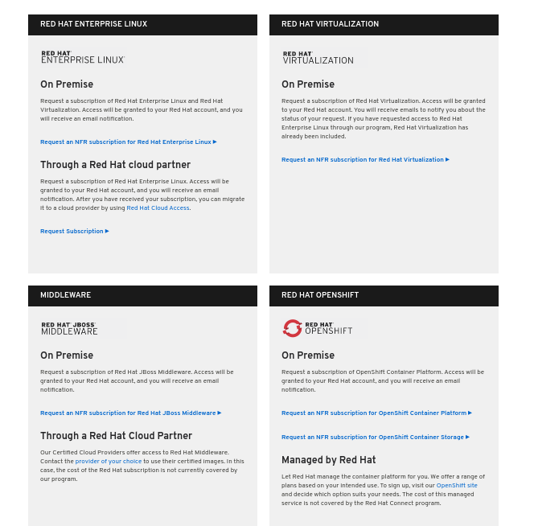

# Request Software Access

From the [Red Hat Partner Connect web portal](https://connect.redhat.com/), login to your account. 

There are several ways to Request Software Access. 

1. You can simply go to: [Benefits - Software Access](https://connect.redhat.com/benefits/software-access).   OR
2. Another option is Clicking on Zones in the upper toolbar and selecting **NFR software downloads**

On the Red Hat Software Access Page, scroll down to **PLATFORMS** and click **REQUEST SUBSCRIPTION** under the software you need


In order to open a Support Case through Red Hat, you will need to select OpenShift Access


You will receive an email once software access has been granted.

