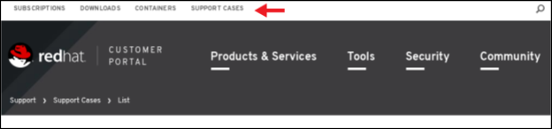
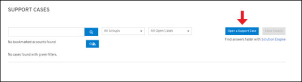

# Getting help

To better assist you and answer your questions; please open a Support Ticket. An engineer will be in contact with you shortly regarding your request. 


If you get an error message stating: _**"You are not allowed to create a support ticket."**_ Please request OpenShift software first.  You can find more information here: [Request Software Access.](https://redhat-connect.gitbook.io/partner-guide-for-red-hat-openshift-and-container/program-on-boarding/request-software-access) 


## **Instructions to Open a Support Ticket**

For any web portal issues or help with your certified image, please open a support case on the Red Hat Customer Portal and follow the steps below.

1. Log in to the  [Red Hat Customer Portal](https://access.redhat.com/)  
2. Click on Support Cases located on white bar located at the top of the page.  

1. Click Open a New Support Case

Complete the Support Case Form with special attention to the following fields:

* From the Product field, select OpenShift Container Platform.
* From the Product Version field, select the version of the Red Hat product
* In the Case Type field, select Certification
* In the Problem Statement field, add a brief description of the issue
* In the Case Description field, add specific details of the encountered issue. If you have a screen shot of the error, please include it in your ticket.
* Choose the severity level for your case using the following guidance: [Red Hat Support Severity Level Definitions](https://access.redhat.com/support/policy/severity/) 

